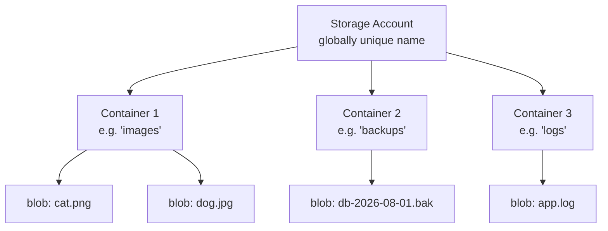
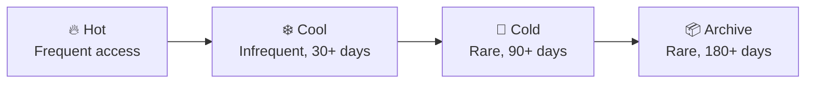

# 🗄️ Azure Blob Storage — Cheat Sheet

*A quick-reference guide for beginner → intermediate cloud learners*

---

## 1. What Is It?

Azure Blob Storage is Microsoft's **object storage** service for unstructured data — images, videos, logs, backups, documents, VM disks, and big-data files. Consider this as Azure's version of AWS S3.

```
Storage Account
   └── Container (like a "bucket" / top-level folder)
         └── Blob (the actual file/object)
```

### The Hierarchy Diagram



> 📌 There is **no real folder structure** inside a container — "folders" are just `/` characters in the blob name (virtual directories).

---

## 2. Blob Types

| Type | Best For | Max Size | Notes |
|---|---|---|---|
| **Block Blob** | Files, images, docs, backups, streaming media | ~190.7 TiB | Most common type; made of uploadable blocks |
| **Append Blob** | Logging, continuously appended data | ~195 GB | Optimized for append-only writes |
| **Page Blob** | VHD/VM disks, random read/write | 8 TiB | Backbone of Azure managed disks |

---

## 3. Access Tiers (Cost Optimization)



| Tier | Storage Cost | Access Cost | Retrieval Latency | Min. Storage Duration |
|---|---|---|---|---|
| Hot | High | Low | Milliseconds | None |
| Cool | Medium | Medium | Milliseconds | 30 days |
| Cold | Low | Higher | Milliseconds | 90 days |
| Archive | Lowest | Highest | **Hours** (rehydration needed) | 180 days |

> ⚠️ **Gotcha:** Archive tier blobs are **offline** — you must "rehydrate" them (standard: up to 15 hrs, high priority: <1 hr) before reading. You can't just download an archived blob instantly!

---

## 4. Redundancy (Replication) Options

| Option | Copies | Survives | Use When |
|---|---|---|---|
| **LRS** (Locally Redundant) | 3 copies, 1 datacenter | Hardware failure | Cheapest, non-critical data |
| **ZRS** (Zone Redundant) | 3 copies, 3 zones | Zone outage | Regional HA needs |
| **GRS** (Geo Redundant) | 6 copies, 2 regions | Region outage | Disaster recovery |
| **RA-GRS** | Same as GRS + **read access** to secondary | Region outage | DR + read from secondary |
| **GZRS** | ZRS + geo-replication | Zone + region outage | Mission-critical apps |

---

## 5. Common Use Cases

- 🖼️ **Serving images/videos** directly to browsers or CDN
- 💾 **Backup & disaster recovery** target
- 📊 **Data lake** for analytics (Azure Data Lake Storage Gen2 is Blob Storage + hierarchical namespace)
- 📁 **File sync / archive** for cold data (Archive tier)
- 🖥️ **VM disks** (Page blobs, mostly abstracted now via Managed Disks)
- 📝 **Static website hosting** (HTML/CSS/JS served straight from a `$web` container)
- 🔄 **Streaming/logging pipelines** (Append blobs)
- 🤖 **Training data storage** for ML/AI pipelines

---

## 6. Azure CLI Cheat Sheet

### Setup
```bash
# Login
az login

# Create a resource group
az group create --name myRG --location eastus

# Create a storage account
az storage account create \
  --name mystorageacct123 \
  --resource-group myRG \
  --location eastus \
  --sku Standard_LRS \
  --kind StorageV2 \
  --access-tier Hot
```

### Containers
```bash
# Get connection string (or use --account-key)
az storage account show-connection-string \
  --name mystorageacct123 --resource-group myRG

# Create a container
az storage container create \
  --name mycontainer \
  --account-name mystorageacct123

# List containers
az storage container list --account-name mystorageacct123 -o table

# Set public access level (off by default)
az storage container set-permission \
  --name mycontainer \
  --account-name mystorageacct123 \
  --public-access blob
```

### Blobs
```bash
# Upload a file
az storage blob upload \
  --account-name mystorageacct123 \
  --container-name mycontainer \
  --name myfile.txt \
  --file ./myfile.txt

# Upload an entire folder
az storage blob upload-batch \
  --account-name mystorageacct123 \
  --destination mycontainer \
  --source ./local-folder

# List blobs
az storage blob list \
  --account-name mystorageacct123 \
  --container-name mycontainer -o table

# Download a blob
az storage blob download \
  --account-name mystorageacct123 \
  --container-name mycontainer \
  --name myfile.txt \
  --file ./downloaded.txt

# Change access tier
az storage blob set-tier \
  --account-name mystorageacct123 \
  --container-name mycontainer \
  --name myfile.txt \
  --tier Cool

# Delete a blob
az storage blob delete \
  --account-name mystorageacct123 \
  --container-name mycontainer \
  --name myfile.txt

# Generate a temporary SAS URL (expires in 1 hour)
az storage blob generate-sas \
  --account-name mystorageacct123 \
  --container-name mycontainer \
  --name myfile.txt \
  --permissions r \
  --expiry $(date -u -d "1 hour" '+%Y-%m-%dT%H:%MZ') \
  --https-only
```

### Lifecycle Management (auto-tiering/deletion)
```bash
az storage account management-policy create \
  --account-name mystorageacct123 \
  --resource-group myRG \
  --policy @policy.json
```

---

## 7. Security Essentials

| Method | What It Does | When To Use |
|---|---|---|
| **RBAC** (Role-Based Access Control) | Azure AD identity-based permissions | Preferred for apps/users (Storage Blob Data Reader/Contributor roles) |
| **SAS Token** (Shared Access Signature) | Time-limited, scoped URL access | Sharing a file/link temporarily without giving full keys |
| **Access Keys** | Full account-level access | Avoid using directly; rotate regularly, never hardcode |
| **Private Endpoints** | Restrict traffic to a VNet | Locking storage away from the public internet |
| **Encryption at rest** | Enabled by default (Microsoft-managed or customer-managed keys) | Always on — nothing to configure for basics |

> 🔐 **Best Practice:** Disable "Allow Blob public access" at the account level unless you explicitly need public containers (e.g., static website assets).

---

## 8. ⚠️ Common Gotchas (Beginner Traps)

1. **Storage account names must be globally unique**, lowercase, 3–24 chars, no special characters — you'll hit naming collisions often.
2. **Deleting a blob ≠ instantly freeing space** if **soft delete** or **versioning** is enabled — deleted blobs stick around until the retention period expires (this also protects you from accidental deletes, so it's a double-edged sword).
3. **Archive tier blobs can't be read directly** — forgetting to rehydrate first is a classic "why is my file broken" bug.
4. **Case sensitivity**: blob names are case-sensitive (`Photo.jpg` ≠ `photo.jpg`), unlike Windows file systems.
5. **No true "rename"** — renaming a blob means copy + delete under the hood (there's no atomic rename API).
6. **Egress (download) costs money**, ingress (upload) is usually free — moving large amounts of data OUT of Azure can rack up surprise bills.
7. **Public access is a security risk** if left on by default — always double check container-level access settings.
8. **Changing access tier isn't free** — early deletion from Cool/Cold/Archive before the minimum duration triggers an early-deletion penalty fee.
9. **SAS tokens don't expire automatically if misconfigured** — always set an explicit expiry; a leaked SAS URL = leaked data until it expires or is revoked.
10. **Blob Storage vs Data Lake Gen2 vs Azure Files vs Managed Disks** are often confused — Blob = general object storage, ADLS Gen2 = Blob + hierarchical namespace for analytics, Azure Files = SMB/NFS file shares, Managed Disks = VM disks (page blobs under the hood).

---

## 9. Quick Comparison: Blob Storage vs Alternatives

| Service | Purpose |
|---|---|
| **Blob Storage** | General unstructured object storage (files, media, backups) |
| **Azure Files** | Fully managed **file shares** (SMB/NFS) — like a network drive |
| **Azure Data Lake Storage Gen2** | Blob Storage + hierarchical namespace, built for big data analytics |
| **Azure Disk Storage** | Block-level storage for VMs (managed disks) |
| **Azure Table Storage** | NoSQL key-value store for structured data |

---

## 10. Handy Mnemonics

- **"LRS < ZRS < GRS < GZRS"** → more letters = more resilience = more cost
- **"Hot pays to store, Archive pays to read"** → tier cost trade-off in one line
- **"SAS = temporary key to a specific door"**, **"RBAC = permanent ID badge"**

---

*Cheat sheet compiled for quick review — pair this with hands-on practice in the Azure Portal or CLI for best retention.*