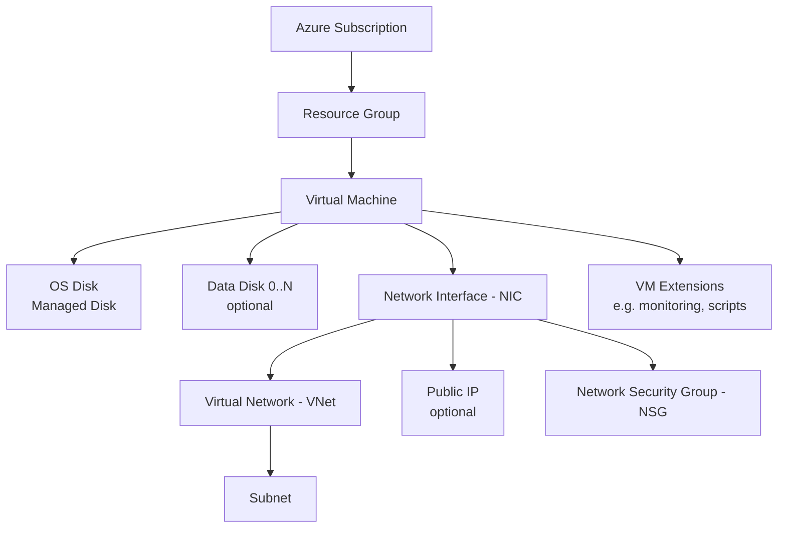
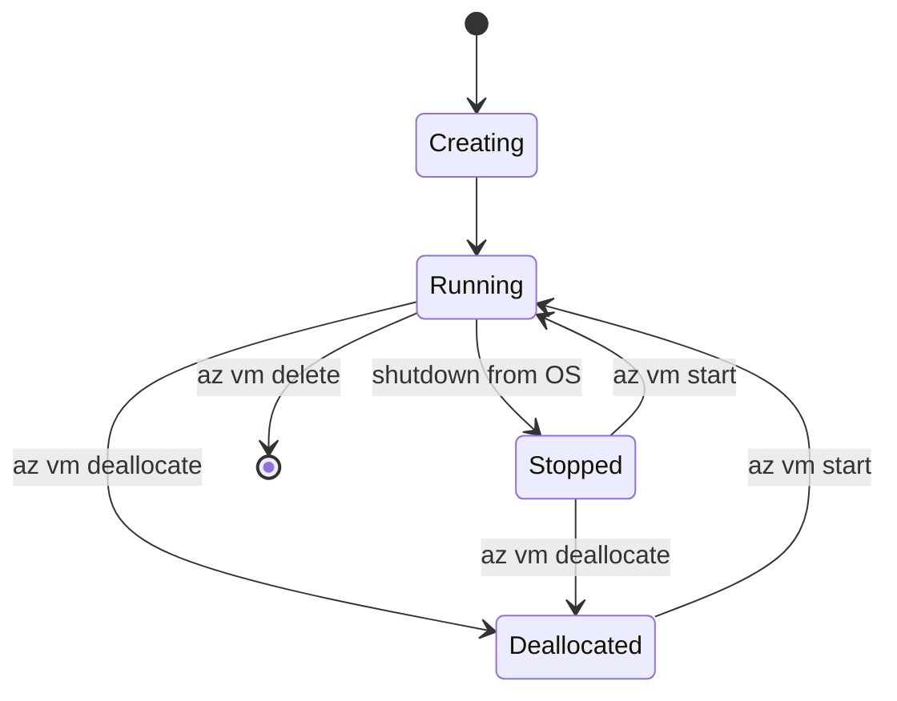
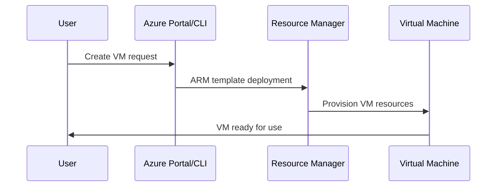
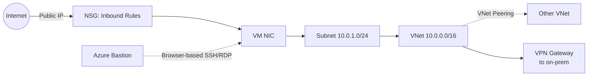

# 💻 Azure Virtual Machines — Comprehensive Cheat Sheet

---

## 1. What Is Azure Virtual Machines?

Azure VMs are Microsoft's **Infrastructure-as-a-Service (IaaS)** compute offering — on-demand, resizable virtual servers where **you** manage the OS, patching, and installed software, unlike PaaS (App Service, Functions) where Azure manages the runtime for you. Use VMs when you need full control of the stack; use PaaS when you don't want to manage servers at all.



> 📌 A VM is a **bundle of independently billed resources**: compute (the VM itself, billed hourly while running), storage (managed disks, billed regardless of VM state), and networking (NIC, public IP, NSG). Deleting the VM object does **not** automatically delete the others.

---

## 2. Core Building Blocks

| Component | What It Is | Notes |
|---|---|---|
| **VM Size (SKU)** | CPU/RAM/disk/network spec | Drives cost the most; e.g. `Standard_B2s`, `Standard_D4s_v5` |
| **Image** | OS template used to create the VM | Marketplace (Ubuntu, Windows Server, RHEL), custom images, Shared Image Gallery |
| **OS Disk** | Boot volume (C:\ or /) | Managed Disk by default; persists after VM deletion unless configured otherwise |
| **Data Disk** | Extra attached storage | 0–64 disks depending on size; used for databases, app data, logs |
| **Temporary Disk** | Local, ephemeral SSD | **Not persistent** — data lost on deallocate/resize/host maintenance |
| **NIC (Network Interface)** | Connects VM to a VNet/subnet | A VM can have multiple NICs (accelerated networking, multi-homed setups) |
| **NSG (Network Security Group)** | Firewall rules | Can attach at subnet level, NIC level, or both |
| **Public IP** | Internet-facing address | Optional; omit for internal-only VMs behind a load balancer/Bastion |
| **Availability Set / Zone** | Fault-tolerance grouping | Spreads VMs across racks (sets) or datacenters (zones) |
| **VM Extensions** | Post-deployment configuration agents | Custom Script Extension, Azure Monitor Agent, Desired State Config |
| **Managed Identity** | Azure AD identity attached to the VM | Lets the VM auth to other Azure services without stored credentials |

---

## 3. VM Series Cheat Sheet

| Series | Optimized For | Example Use Case |
|---|---|---|
| **A-series** | Entry-level/legacy, lowest cost | Dev/test, minimal workloads |
| **B-series (Burstable)** | Variable load, credits-based CPU bursting | Small web apps, dev/test, low-traffic sites |
| **D-series (General Purpose)** | Balanced CPU:memory ratio | Most business apps, web/app servers |
| **E-series (Memory Optimized)** | High RAM-to-core ratio | SQL Server, SAP HANA, in-memory caching |
| **F-series (Compute Optimized)** | High CPU-to-memory ratio | Batch processing, gaming servers, web front-ends |
| **L-series (Storage Optimized)** | High disk throughput/IOPS | NoSQL (Cassandra, MongoDB), big data |
| **N-series (GPU)** | Graphics/AI/CUDA workloads | ML training/inference, rendering, simulation |
| **M-series (Memory/Ultra-High Mem)** | Extreme RAM (up to several TB) | Massive in-memory databases (SAP HANA at scale) |
| **H-series (High Performance Compute)** | HPC workloads | Fluid dynamics, seismic processing, genomics |

> 💡 **Naming decoder:** `Standard_D4s_v5`
> - `D` = series family
> - `4` = number of vCPUs
> - `s` = supports Premium SSD (only "s"-suffixed sizes can attach Premium/Ultra disks)
> - `v5` = generation/version (higher = newer hardware, usually better price/performance)
> - Additional letter suffixes can indicate: `a` (AMD CPU), `d` (local temp disk present), `p` (ARM-based)


## 4. Lifecycle / State Model



## VM Lifecycle



---

| State | Compute Billed? | Storage Billed? | Notes |
|---|---|---|---|
| **Running** | ✅ Yes | ✅ Yes | Fully active, accessible |
| **Stopped** (OS shutdown, not deallocated) | ✅ Yes | ✅ Yes | ⚠️ Classic beginner trap — still billed for compute! |
| **Deallocated** | ❌ No | ✅ Yes | Compute released; dynamic public IP is **released** too |
| **Deleted** | ❌ No | ❌ No (unless disks/NIC/IP kept) | Associated resources often survive and keep billing |

> ⚠️ **Gotcha:** Shutting down from inside the OS (`shutdown -h now`, Windows "Shut down") leaves the VM in **Stopped**, not **Deallocated**. You must stop it via Azure CLI/Portal/PowerShell (`az vm deallocate`) to actually stop compute billing.

---

## 5. Common Use Cases

- 🖥️ **Lift-and-shift migrations** — move on-prem servers to Azure with minimal changes
- 🌐 **Custom web/app hosting** — full stack control (IIS, nginx, custom runtimes/dependencies)
- 🗃️ **Self-managed databases** — SQL Server, PostgreSQL, MongoDB, Oracle
- 🧪 **Dev/test environments** — spin up, snapshot, and tear down on demand
- 🤖 **AI/ML training & inference** — GPU-backed N-series VMs
- 🔐 **Domain controllers / legacy enterprise apps** — software requiring full OS-level access
- 📦 **Self-hosted CI/CD build agents** — Jenkins, GitHub Actions runners
- 🖧 **Network appliances** — VPN gateways, firewalls, load balancers via 3rd-party images
- 🧮 **HPC & batch workloads** — scientific computing, rendering farms
- 🏢 **SAP / ERP workloads** — M-series and E-series for certified SAP deployments

---

## 6. 🔐 Security Best Practices

- Use **Managed Identities** for authentication
- Apply **NSGs** to control inbound/outbound traffic
- Enable **Azure Defender for Cloud**
- Regularly patch OS and applications
- Store secrets in **Azure Key Vault**

---

## 7. 📊 Monitoring & Scaling

- **Azure Monitor**: Metrics, logs, alerts
- **Autoscale**: Scale sets for load-based scaling
- **Diagnostics**: Boot diagnostics, performance counters
- **Log Analytics**: Centralized query and analysis

---

## 8. Azure CLI Cheat Sheet

### Setup & Creation
```bash
# Login
az login

# Create a resource group
az group create --name myRG --location eastus

# Quick Linux VM (auto-generates SSH keys)
az vm create \
  --resource-group myRG \
  --name myVM \
  --image Ubuntu2204 \
  --size Standard_B2s \
  --admin-username azureuser \
  --generate-ssh-keys

# Windows VM
az vm create \
  --resource-group myRG \
  --name myWinVM \
  --image Win2022Datacenter \
  --size Standard_D2s_v5 \
  --admin-username azureadmin \
  --admin-password "ComplexP@ssw0rd123!"

# VM with a static public IP and specific VNet/subnet
az vm create \
  --resource-group myRG \
  --name myVM \
  --image Ubuntu2204 \
  --size Standard_B2s \
  --vnet-name myVNet --subnet mySubnet \
  --public-ip-sku Standard \
  --admin-username azureuser --generate-ssh-keys
```

### Managing VM State
```bash
# Start
az vm start --resource-group myRG --name myVM

# Deallocate (stops billing for compute)
az vm deallocate --resource-group myRG --name myVM

# Restart
az vm restart --resource-group myRG --name myVM

# Check power state
az vm get-instance-view \
  --resource-group myRG --name myVM \
  --query "instanceView.statuses[1]" -o table

# List all VMs with power state across the subscription
az vm list -d -o table
```

### Connecting
```bash
# SSH into Linux VM
ssh azureuser@<public-ip-address>

# Get public IP of a VM
az vm show --resource-group myRG --name myVM -d --query publicIps -o tsv

# Run a shell command remotely without SSH access (Linux)
az vm run-command invoke \
  --resource-group myRG --name myVM \
  --command-id RunShellScript \
  --scripts "sudo apt update && sudo apt upgrade -y"

# Run a PowerShell command remotely (Windows)
az vm run-command invoke \
  --resource-group myRG --name myWinVM \
  --command-id RunPowerShellScript \
  --scripts "Get-Service | Where-Object {$_.Status -eq 'Running'}"

# Connect via Azure Bastion (no public IP needed)
az network bastion ssh \
  --name myBastion --resource-group myRG \
  --target-resource-id <vm-resource-id> \
  --auth-type ssh-key --username azureuser --ssh-key ~/.ssh/id_rsa
```

### Resizing & Scaling
```bash
# List available sizes in a region
az vm list-sizes --location eastus -o table

# Resize a VM (some sizes require deallocation first)
az vm deallocate --resource-group myRG --name myVM
az vm resize --resource-group myRG --name myVM --size Standard_D4s_v5

# Create a Virtual Machine Scale Set (auto-scaling group)
az vmss create \
  --resource-group myRG \
  --name myScaleSet \
  --image Ubuntu2204 \
  --instance-count 2 \
  --admin-username azureuser --generate-ssh-keys \
  --vm-sku Standard_B2s \
  --load-balancer myLB

# Configure autoscale rules on a scale set (CPU-based)
az monitor autoscale create \
  --resource-group myRG --resource myScaleSet \
  --resource-type Microsoft.Compute/virtualMachineScaleSets \
  --name autoscale-config --min-count 2 --max-count 10 --count 2

az monitor autoscale rule create \
  --resource-group myRG --autoscale-name autoscale-config \
  --condition "Percentage CPU > 75 avg 5m" \
  --scale out 2
```

### Disks
```bash
# Attach a new managed data disk
az vm disk attach \
  --resource-group myRG --vm-name myVM \
  --name myDataDisk --new --size-gb 128 --sku Premium_LRS

# List disks attached to a VM
az vm show --resource-group myRG --name myVM \
  --query "storageProfile.dataDisks" -o table

# Detach a disk
az vm disk detach \
  --resource-group myRG --vm-name myVM --name myDataDisk

# Take a snapshot of the OS disk
az snapshot create \
  --resource-group myRG --name myOsDiskSnapshot \
  --source myVM_OsDisk
```

### Networking & Security
```bash
# Open a port (e.g., 8080) via NSG rule
az vm open-port \
  --resource-group myRG --name myVM \
  --port 8080 --priority 900

# List NSG rules
az network nsg rule list \
  --resource-group myRG --nsg-name myVMNSG -o table

# Assign a static public IP
az network public-ip update \
  --resource-group myRG --name myVMPublicIP \
  --allocation-method Static

# Assign a system-managed identity to a VM
az vm identity assign --resource-group myRG --name myVM

# Grant that identity a role (e.g., read a storage account)
az role assignment create \
  --assignee <principal-id> \
  --role "Storage Blob Data Reader" \
  --scope <storage-account-resource-id>
```

### Automation / Cost Hygiene
```bash
# Enable auto-shutdown at 7 PM daily
az vm auto-shutdown --resource-group myRG --name myVM --time 1900

# Tag a VM (for cost tracking/governance)
az vm update --resource-group myRG --name myVM --set tags.env=dev

# Apply an OS patch update assessment
az vm assess-patches --resource-group myRG --name myVM
```

### Cleanup
```bash
# Delete a VM (does NOT delete disks/NIC/IP by default!)
az vm delete --resource-group myRG --name myVM --yes

# Explicitly clean up leftover resources
az disk delete --resource-group myRG --name myVM_OsDisk --yes
az network nic delete --resource-group myRG --name myVMVMNic
az network public-ip delete --resource-group myRG --name myVMPublicIP

# Fastest option for dev/test: delete the whole resource group
az group delete --name myRG --yes --no-wait
```

---

## 9. Networking Deep Dive



| Concept | Purpose |
|---|---|
| **VNet** | Isolated private network in Azure |
| **Subnet** | Segmented IP range within a VNet |
| **NSG** | Allow/deny rules by port, protocol, source/destination |
| **Public IP** | Direct internet access (Static or Dynamic SKU) |
| **Load Balancer** | Distributes traffic across multiple VM instances |
| **VNet Peering** | Private connection between two VNets |
| **Azure Bastion** | Browser-based RDP/SSH — no public IP required on the VM |
| **Accelerated Networking** | SR-IOV based low-latency, high-throughput NIC option (supported sizes only) |

---

## 10. Availability, Resiliency & Scaling

| Feature | Protects Against | Requirement / Notes |
|---|---|---|
| **Availability Set** | Rack/hardware failure within one datacenter | Requires 2+ VMs; groups into fault + update domains |
| **Availability Zone** | Entire datacenter failure | Requires zone-redundant deployment across 3 zones |
| **VM Scale Set (VMSS)** | Load spikes + individual instance failures | Auto-scales instance count based on metrics |
| **Azure Site Recovery (ASR)** | Regional disaster | Full region failover / DR orchestration |
| **Load Balancer / App Gateway** | Traffic distribution + health probes | Removes unhealthy instances from rotation |

> 💡 SLA reference: a **single VM** with Premium SSD ≈ 99.9%. Add **Availability Zones** and it can reach **99.99%**.

---

## 11. Pricing Model Basics

| Pricing Option | Best For | Notes |
|---|---|---|
| **Pay-as-you-go** | Unpredictable/short-term workloads | Most flexible, highest per-hour cost |
| **Reserved Instances (1yr/3yr)** | Stable, long-running workloads | Up to ~72% savings vs pay-as-you-go |
| **Azure Hybrid Benefit** | Existing Windows Server/SQL licenses | Reuse on-prem licenses to cut cost significantly |
| **Spot VMs** | Interruptible/batch/stateless workloads | Up to ~90% discount; can be evicted with ~30s notice |
| **Savings Plan for Compute** | Flexible, cross-VM-family commitment | Commit to $/hour spend rather than a specific SKU |

> ⚠️ **Gotcha:** Compute is billed by the second while Running (with a 1-minute minimum), but **Storage, snapshots, and reserved static/Standard public IPs keep billing even when the VM is Deallocated.** Auditing "stopped" resource groups for lingering disks/IPs is a common cost-saving exercise.

---

## 12. ⚠️ Common Gotchas (Beginner Traps)

1. **"Stopped" ≠ "Deallocated"** — OS-level shutdown still bills compute. Always deallocate via Azure tooling to actually stop the meter.
2. **Deleting a VM doesn't delete its disks, NICs, or public IP** by default — these persist and keep costing money until explicitly removed.
3. **Dynamic public IPs change** on every deallocate/restart — use a **Static** allocation if you need a fixed address.
4. **Resizing often requires deallocation first**, and not all sizes exist in all regions — check `az vm list-sizes` before planning capacity.
5. **NSG rules evaluate by priority, lowest number wins** — an overly broad low-priority "deny" rule can silently shadow a more specific "allow" rule added later.
6. **Premium/Ultra SSDs need an "s"-suffixed VM size** (e.g., `Standard_D2s_v5`) — attaching to a non-"s" size fails.
7. **Temporary disks are ephemeral** — anything written there is lost on deallocate, resize, or host maintenance; never store persistent data on it.
8. **Local admin password policy is strict** (12+ chars, complexity rules) — a weak password fails VM creation with a non-obvious error.
9. **Boot diagnostics storage and orphaned OS disk snapshots** are frequently forgotten cost sources long after the VM itself is gone.
10. **Region/size/quota availability varies** — a VM size or image might not exist (or might be quota-capped) in your target region/subscription.
11. **SSH key auth is the Linux default** — switching to password auth requires an explicit flag and is discouraged for production.
12. **Auto-shutdown is opt-in, not default** — dev/test VMs left running overnight/weekends are a classic budget killer; schedule auto-shutdown explicitly.
13. **Accelerated Networking can't be enabled after creation on some configurations** — plan for it at VM creation time if low-latency networking matters.

---

## 13. Quick Comparison: VMs vs Alternatives

| Service | Control Level | Management Overhead | Best For |
|---|---|---|---|
| **Virtual Machines (IaaS)** | Full OS control | High (you patch/manage) | Legacy apps, custom stacks, lift-and-shift |
| **App Service (PaaS)** | App-level only | Low | Web apps, APIs — no OS management |
| **Azure Container Instances (ACI)** | Container-level | Low | Quick, single-container, on-demand workloads |
| **AKS (Kubernetes)** | Orchestration-level | Medium | Microservices, complex containerized apps |
| **Azure Functions** | Code-level only | Minimal | Event-driven, serverless, short-lived executions |
| **VM Scale Sets** | Full OS control, auto-managed count | Medium | Horizontally scaling identical VM workloads |

---

## 14. Handy Mnemonics

- **"Stopped still spends, Deallocated doesn't"** → billing state rule
- **"B for Budget, D for Default, E for Extra RAM, F for Fast CPU, N for Nvidia/GPU, L for Local storage-heavy"** → series memory hook
- **"Deleting the VM ≠ deleting the bill"** → always clean up disks/NICs/IPs
- **"Lowest priority number wins"** → NSG rule evaluation order
- **"'s' in the SKU means SSD-ready (Premium)"** → disk compatibility check

---

## 15. 📚 Useful References

- Azure VM Documentation [(learn.microsoft.com in Bing)](https://www.bing.com/search?q="https%3A%2F%2Flearn.microsoft.com%2Fazure%2Fvirtual-machines%2F")
- Azure CLI Reference [(learn.microsoft.com in Bing)](https://www.bing.com/search?q="https%3A%2F%2Flearn.microsoft.com%2Fcli%2Fazure%2Fvm")
- [Pricing Calculator](https://azure.microsoft.com/pricing/calculator/)

---

*Cheat sheet compiled for quick review — pair this with hands-on practice in the Azure Portal or CLI (`az vm --help`) for best retention.