# 🚀 The Complete Git Cheat Sheet — Beginner to Pro

A comprehensive, illustrated reference for Git on the Linux CLI.


---

## 📑 Table of Contents

- [🚀 The Complete Git Cheat Sheet — Beginner to Pro](#-the-complete-git-cheat-sheet--beginner-to-pro)
  - [📑 Table of Contents](#-table-of-contents)
  - [1. Installing \& Configuring Git](#1-installing--configuring-git)
    - [Install on Linux](#install-on-linux)
    - [First-Time Setup](#first-time-setup)
  - [2. Creating a Repository](#2-creating-a-repository)
  - [3. The Git Workflow (Three Trees)](#3-the-git-workflow-three-trees)
  - [4. Staging \& Committing](#4-staging--committing)
    - [Commit Message Convention (Recommended)](#commit-message-convention-recommended)
  - [5. Checking Status \& History](#5-checking-status--history)
    - [`git log --oneline --graph --all`](#git-log---oneline---graph---all)
  - [6. Branching](#6-branching)
  - [7. Merging](#7-merging)
  - [8. Rebasing](#8-rebasing)
    - [Interactive Rebase Options (`git rebase -i`)](#interactive-rebase-options-git-rebase--i)
  - [9. Resolving Merge Conflicts](#9-resolving-merge-conflicts)
    - [Step-by-Step Conflict Resolution](#step-by-step-conflict-resolution)
  - [10. Working with Remotes](#10-working-with-remotes)
    - [HTTPS vs SSH](#https-vs-ssh)
  - [11. Push, Pull \& Fetch](#11-push-pull--fetch)
  - [12. Undoing Changes](#12-undoing-changes)
    - [`reset` vs `revert` — When to Use Which](#reset-vs-revert--when-to-use-which)
  - [13. Stashing](#13-stashing)
  - [14. Tags](#14-tags)
  - [15. Cherry-Picking](#15-cherry-picking)
  - [16. Git Reflog (The Time Machine)](#16-git-reflog-the-time-machine)
  - [17. Bisecting (Finding Bugs)](#17-bisecting-finding-bugs)
  - [18. Submodules](#18-submodules)
  - [19. .gitignore](#19-gitignore)
  - [20. Common Collaboration Workflow (Fork \& PR)](#20-common-collaboration-workflow-fork--pr)
  - [21. Quick Reference Table](#21-quick-reference-table)
  - [22. Best Practices](#22-best-practices)
  - [🎯 Bonus: Common Git Aliases](#-bonus-common-git-aliases)

---

## 1. Installing & Configuring Git

### Install on Linux

```bash
# Debian/Ubuntu
sudo apt update && sudo apt install git -y

# Fedora
sudo dnf install git -y

# Arch
sudo pacman -S git

# Verify installation
git --version
```

### First-Time Setup

```bash
# Identity (required before your first commit)
git config --global user.name "Sanjay Kumar"
git config --global user.email "sanjay@example.com"

# Set default branch name for new repos
git config --global init.defaultBranch main

# Set default editor
git config --global core.editor "vim"      # or "nano", "code --wait"

# Enable colored output
git config --global color.ui auto

# View all config settings
git config --list

# View a specific setting
git config user.name

# Edit config file directly
git config --global --edit
```

**Config levels** (in order of precedence, highest first):

| Level | Flag | File Location |
|---|---|---|
| Local (repo-specific) | `--local` (default) | `.git/config` |
| Global (user-specific) | `--global` | `~/.gitconfig` |
| System (machine-wide) | `--system` | `/etc/gitconfig` |

---

## 2. Creating a Repository

```bash
# Initialize a new repo in the current directory
git init

# Initialize with a specific initial branch name
git init -b main

# Clone an existing remote repository
git clone https://github.com/user/repo.git

# Clone into a specific folder name
git clone https://github.com/user/repo.git my-folder

# Clone only a specific branch
git clone -b develop --single-branch https://github.com/user/repo.git

# Shallow clone (only latest commit — faster, smaller)
git clone --depth 1 https://github.com/user/repo.git
```

---

## 3. The Git Workflow (Three Trees)

Git tracks your files across **three areas**. Understanding this is the key to understanding every Git command.

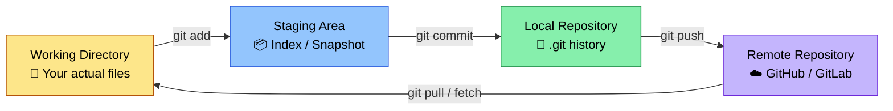

| Area | Description | Command to move forward |
|---|---|---|
| **Working Directory** | Files you're actively editing | `git add` → moves to Staging |
| **Staging Area (Index)** | Snapshot of changes about to be committed | `git commit` → moves to Repository |
| **Local Repository** | Permanent, committed snapshots (`.git` folder) | `git push` → moves to Remote |
| **Remote Repository** | Shared copy on GitHub/GitLab/Bitbucket | `git pull`/`fetch` → brings back to local |

---

## 4. Staging & Committing

```bash
# Check what's changed
git status

# Stage a specific file
git add filename.txt

# Stage multiple files
git add file1.txt file2.txt

# Stage everything (new, modified, deleted)
git add .
git add -A

# Stage interactively (choose hunks)
git add -p

# Unstage a file (keep changes in working dir)
git restore --staged filename.txt
# (older Git versions)
git reset HEAD filename.txt

# Commit staged changes
git commit -m "commit message"

# Stage AND commit tracked files in one step
git commit -am "commit message"

# Amend the last commit (message or add missed files)
git commit --amend -m "Corrected commit message"

# Amend without changing the commit message
git commit --amend --no-edit
```

### Commit Message Convention (Recommended)

```
<type>(scope): short summary

Longer description if needed, explaining WHY not WHAT.

Types: feat, fix, docs, style, refactor, test, chore
```

Example: `feat(auth): add JWT-based login flow`

---

## 5. Checking Status & History

```bash
# Current state of working directory & staging area
git status
git status -s          # short format

# View commit history
git log
git log --oneline                    # compact, one line per commit
git log --oneline --graph --all      # visual branch graph
git log -p                           # show diffs for each commit
git log -5                           # last 5 commits only
git log --author="Kumar"             # filter by author
git log --since="2 weeks ago"
git log --grep="fix"                 # search commit messages

# Show changes not yet staged
git diff

# Show staged changes (about to be committed)
git diff --staged
git diff --cached

# Show a specific commit's details
git show <commit-hash>

# Who changed each line of a file (blame)
git blame filename.txt
```

### `git log --oneline --graph --all` 
Example Output

```
* 9f2c1a3 (HEAD -> main) Merge branch 'feature/login'
|\
| * 7b1e0d2 (feature/login) Add password validation
| * a3d5f11 Add login form UI
|/
* c0ffee1 Initial commit
```

---

## 6. Branching

Branches let you work on features in isolation without affecting `main`.

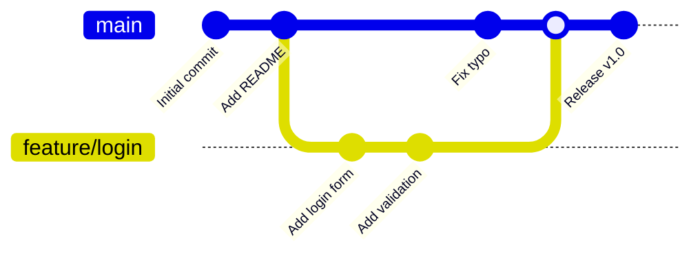

```bash
# List all local branches (* marks current)
git branch

# List all branches, including remote
git branch -a

# Create a new branch (doesn't switch to it)
git branch feature/login

# Switch to a branch
git checkout feature/login
git switch feature/login          # newer, clearer syntax

# Create AND switch in one command
git checkout -b feature/login
git switch -c feature/login

# Rename current branch
git branch -m new-branch-name

# Delete a branch (safe — blocks if unmerged)
git branch -d feature/login

# Force delete a branch (discards unmerged work)
git branch -D feature/login

# Delete a remote branch
git push origin --delete feature/login

# Show branches merged / not merged into current branch
git branch --merged
git branch --no-merged
```

---

## 7. Merging

Merging combines the history of two branches.

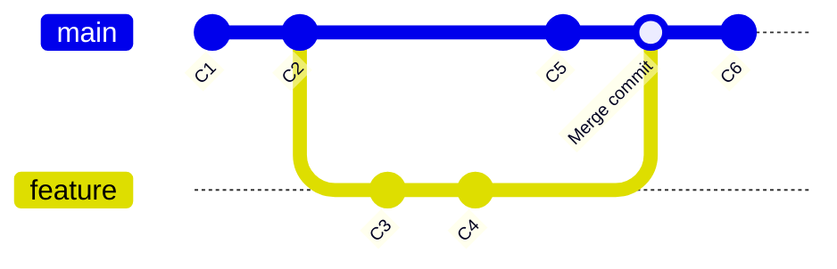

```bash
# Merge a branch into your current branch
git checkout main
git merge feature/login

# Fast-forward merge (default, if no divergent history)
git merge feature/login

# Force a merge commit even if fast-forward is possible
git merge --no-ff feature/login

# Abort a merge in progress (e.g., due to conflicts)
git merge --abort

# Squash all commits from a branch into one before merging
git merge --squash feature/login
git commit -m "Add complete login feature"
```

**Fast-forward vs. No-FF merge:**

| Type | When it happens | History result |
|---|---|---|
| **Fast-forward** | No new commits on `main` since branch was created | Linear history, no merge commit |
| **No-FF (`--no-ff`)** | Forces a merge commit | Preserves branch context, easier to revert |
| **Three-way merge** | Both branches have new commits | Creates a merge commit combining both |

---

## 8. Rebasing

Rebasing rewrites history by replaying your commits on top of another branch — creating a **linear** history instead of a merge commit.

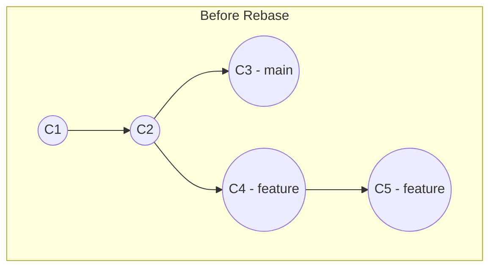

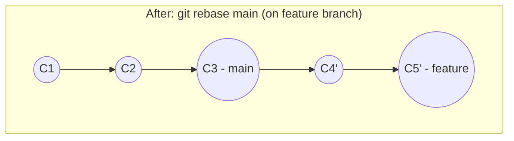

```bash
# Rebase current branch onto main
git checkout feature/login
git rebase main

# Interactive rebase — squash, reword, reorder, drop commits
git rebase -i HEAD~5

# Continue after resolving a conflict during rebase
git rebase --continue

# Skip the current commit during rebase
git rebase --skip

# Abort the rebase and return to original state
git rebase --abort
```

### Interactive Rebase Options (`git rebase -i`)

```
pick   a1b2c3  Add login form
squash d4e5f6  Fix typo in login form      # combine with previous commit
reword g7h8i9  Add validation              # edit commit message
drop   j1k2l3  Debug console.log           # remove this commit entirely
edit   m4n5o6  Add tests                   # pause to amend this commit
```

> ⚠️ **Golden Rule of Rebasing:** Never rebase commits that have already been pushed and shared with others — it rewrites history and breaks collaborators' clones.

---

## 9. Resolving Merge Conflicts

Conflicts happen when Git can't automatically reconcile changes to the same lines.

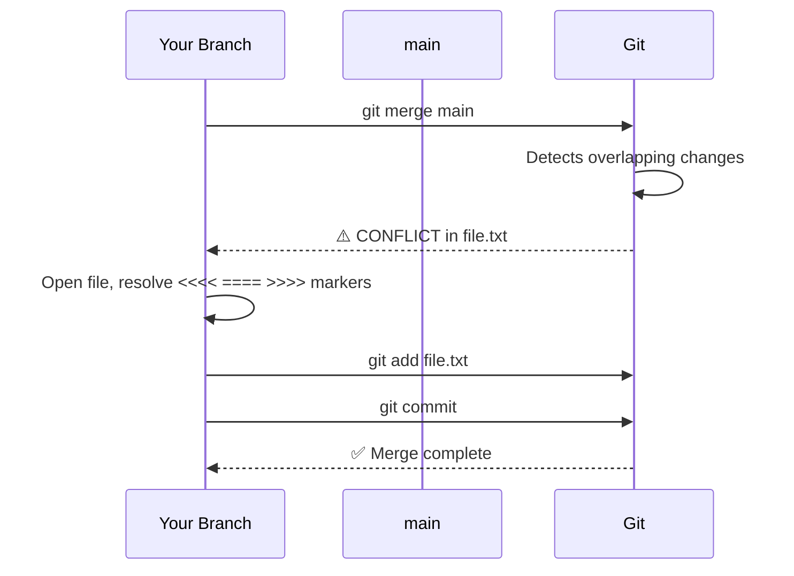

### Step-by-Step Conflict Resolution

```bash
# 1. Attempt the merge
git merge feature/login

# Output: CONFLICT (content): Merge conflict in login.js
```

**2. Open the conflicted file.** Git inserts conflict markers:

```javascript
<<<<<<< HEAD (Current Change - main)
const maxAttempts = 3;
=======
const maxAttempts = 5;
>>>>>>> feature/login (Incoming Change)
```

```bash
# 3. Edit the file to keep the correct code, remove ALL markers
#    (<<<<<<<, =======, >>>>>>>)

# 4. Check which files are still conflicted
git status

# 5. Mark the conflict as resolved
git add login.js

# 6. Complete the merge
git commit
# (Git pre-fills a merge commit message — just save & exit)

# --- Alternative shortcuts ---

# Keep YOUR version entirely for a file
git checkout --ours login.js
git add login.js

# Keep THEIR version entirely for a file
git checkout --theirs login.js
git add login.js

# Use a visual merge tool
git mergetool

# Abort and go back to pre-merge state
git merge --abort
```

---

## 10. Working with Remotes

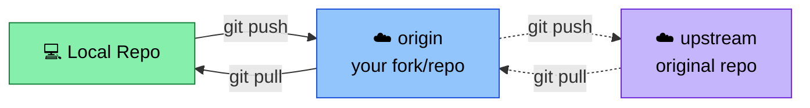

```bash
# List remotes
git remote -v

# Add a new remote
git remote add origin https://github.com/user/repo.git

# Add an "upstream" remote (common in fork workflows)
git remote add upstream https://github.com/original-owner/repo.git

# Change a remote's URL
git remote set-url origin git@github.com:user/repo.git

# Rename a remote
git remote rename origin old-origin

# Remove a remote
git remote remove upstream

# Show detailed info about a remote
git remote show origin
```

### HTTPS vs SSH

| Method | URL format | Auth |
|---|---|---|
| HTTPS | `https://github.com/user/repo.git` | Username + Personal Access Token |
| SSH | `git@github.com:user/repo.git` | SSH key pair (no password prompts) |

```bash
# Generate an SSH key (if you don't have one)
ssh-keygen -t ed25519 -C "sanjay@example.com"

# Add it to the ssh-agent
eval "$(ssh-agent -s)"
ssh-add ~/.ssh/id_ed25519

# Copy public key to add to GitHub/GitLab settings
cat ~/.ssh/id_ed25519.pub
```

---

## 11. Push, Pull & Fetch

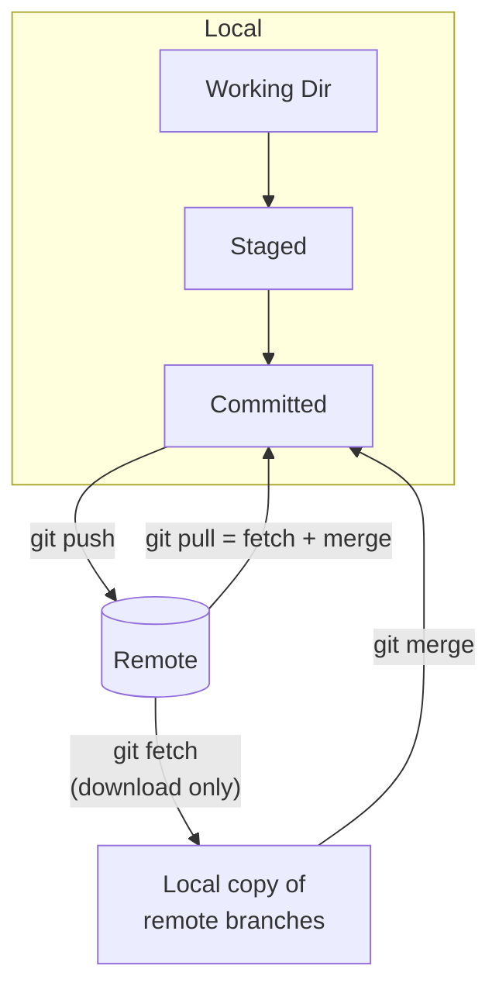

```bash
# Push current branch to its remote
git push

# Push and set upstream tracking (first push of a new branch)
git push -u origin feature/login

# Push all branches
git push --all

# Push tags
git push --tags

# Force push (⚠️ overwrites remote history — use with caution)
git push --force

# Safer force push (fails if remote has commits you don't have locally)
git push --force-with-lease

# Fetch changes without merging (just downloads)
git fetch origin

# Fetch from all remotes
git fetch --all

# Pull = fetch + merge
git pull

# Pull with rebase instead of merge (cleaner history)
git pull --rebase

# Pull a specific branch from a specific remote
git pull origin main
```

---

## 12. Undoing Changes

Git offers several tools for undoing changes, depending on *how far* the change has gone.

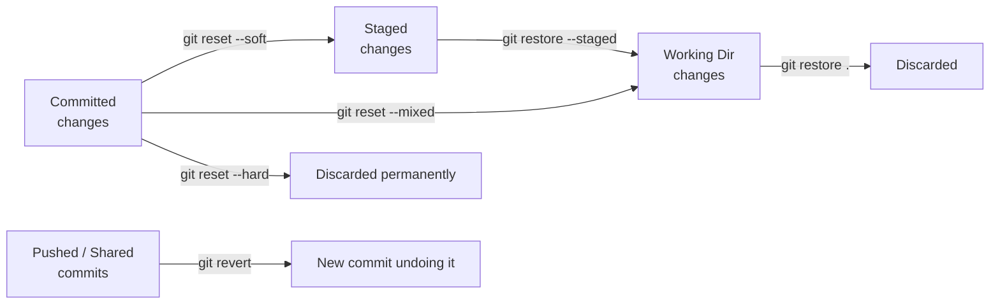

```bash
# Discard changes in working directory (unstaged)
git restore filename.txt
git checkout -- filename.txt        # older syntax

# Discard ALL unstaged changes
git restore .

# Unstage a file (keep the edits)
git restore --staged filename.txt

# --- git reset: moves HEAD and branch pointer ---

# Soft reset: undo commit, keep changes staged
git reset --soft HEAD~1

# Mixed reset (default): undo commit, keep changes unstaged
git reset HEAD~1
git reset --mixed HEAD~1

# Hard reset: undo commit AND discard all changes (⚠️ destructive)
git reset --hard HEAD~1

# Reset to a specific commit
git reset --hard <commit-hash>

# --- git revert: safe for shared/pushed history ---

# Create a NEW commit that undoes a previous commit
git revert <commit-hash>

# Revert without auto-committing (lets you review first)
git revert --no-commit <commit-hash>

# Remove untracked files (careful!)
git clean -n           # dry run — preview what would be deleted
git clean -f            # actually delete untracked files
git clean -fd           # also delete untracked directories
```

### `reset` vs `revert` — When to Use Which

| Command | Rewrites history? | Safe for shared branches? | Use case |
|---|---|---|---|
| `git reset` | Yes | ❌ No | Undo local, unpushed commits |
| `git revert` | No (adds new commit) | ✅ Yes | Undo commits already pushed/shared |

---

## 13. Stashing

Temporarily shelve changes without committing, useful when you need to switch context quickly.

```bash
# Stash current changes (tracked files)
git stash

# Stash with a descriptive message
git stash save "WIP: refactoring auth logic"

# Stash including untracked files
git stash -u

# List all stashes
git stash list
# Output: stash@{0}: WIP on main: 9f2c1a3 Add login form

# Apply the most recent stash (keeps it in stash list)
git stash apply

# Apply a specific stash
git stash apply stash@{2}

# Apply AND remove the most recent stash
git stash pop

# View changes inside a stash without applying
git stash show -p stash@{0}

# Delete a specific stash
git stash drop stash@{0}

# Delete all stashes
git stash clear

# Create a new branch from a stash
git stash branch new-feature-branch stash@{0}
```

---

## 14. Tags

Tags mark specific points in history — typically used for releases.

```bash
# Lightweight tag (just a pointer)
git tag v1.0.0

# Annotated tag (recommended — includes message, author, date)
git tag -a v1.0.0 -m "Release version 1.0.0"

# Tag an older commit
git tag -a v0.9.0 <commit-hash> -m "Beta release"

# List all tags
git tag

# List tags matching a pattern
git tag -l "v1.*"

# Show tag details
git show v1.0.0

# Push a single tag to remote
git push origin v1.0.0

# Push ALL tags
git push origin --tags

# Delete a local tag
git tag -d v1.0.0

# Delete a remote tag
git push origin --delete v1.0.0

# Checkout a tag (detached HEAD state)
git checkout v1.0.0
```

---

## 15. Cherry-Picking

Apply a specific commit from one branch onto another, without merging the whole branch.

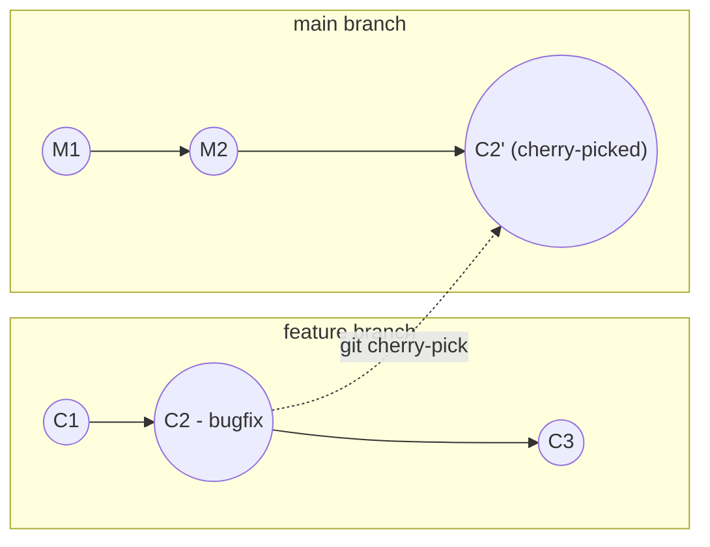

```bash
# Apply a specific commit onto your current branch
git cherry-pick <commit-hash>

# Cherry-pick multiple commits
git cherry-pick <hash1> <hash2>

# Cherry-pick a range of commits
git cherry-pick <hash1>..<hash5>

# Cherry-pick without auto-committing (stage only)
git cherry-pick --no-commit <commit-hash>

# Continue after resolving conflicts during cherry-pick
git cherry-pick --continue

# Abort a cherry-pick
git cherry-pick --abort
```

---

## 16. Git Reflog (The Time Machine)

`reflog` tracks every movement of `HEAD` — a safety net even after a `reset --hard` or deleted branch.

```bash
# View the reflog
git reflog

# Example output:
# 9f2c1a3 HEAD@{0}: commit: Add login validation
# a3d5f11 HEAD@{1}: reset: moving to HEAD~1
# c0ffee1 HEAD@{2}: commit: Initial commit

# Recover a "lost" commit after a hard reset
git reset --hard HEAD@{1}

# Recover a deleted branch
git branch recovered-branch <commit-hash-from-reflog>
```

> 🛟 **Lifesaver tip:** If you ever accidentally delete a branch or reset too far, `git reflog` almost always has your back — Git rarely truly deletes anything for ~30–90 days.

---

## 17. Bisecting (Finding Bugs)

Binary-search through commit history to find which commit introduced a bug.

```bash
# Start a bisect session
git bisect start

# Mark the current commit as bad (has the bug)
git bisect bad

# Mark a known good commit (before the bug existed)
git bisect good v1.0.0

# Git checks out a commit halfway between — test it, then:
git bisect good      # if bug is NOT present
git bisect bad       # if bug IS present

# Repeat until Git identifies the exact culprit commit

# End the session and return to your original branch
git bisect reset

# Automate with a test script
git bisect start HEAD v1.0.0
git bisect run npm test
```

---

## 18. Submodules

Include another Git repository as a subdirectory within your project.

```bash
# Add a submodule
git submodule add https://github.com/user/library.git libs/library

# Clone a repo AND its submodules
git clone --recurse-submodules https://github.com/user/repo.git

# Initialize submodules after a normal clone
git submodule init
git submodule update

# Or combine both
git submodule update --init --recursive

# Pull latest changes for all submodules
git submodule update --remote

# Remove a submodule
git submodule deinit libs/library
git rm libs/library
```

---

## 19. .gitignore

Tell Git which files/folders to never track.

```bash
# Create a .gitignore file
touch .gitignore
```

**Common `.gitignore` example (Python + Node project):**

```gitignore
# Dependencies
node_modules/
venv/
__pycache__/
*.pyc

# Environment & secrets
.env
.env.local
*.key

# Build output
dist/
build/
*.log

# OS files
.DS_Store
Thumbs.db

# IDE
.vscode/
.idea/
```

```bash
# Check if a file is being ignored and why
git check-ignore -v filename.txt

# Stop tracking a file that's now in .gitignore (but keep it locally)
git rm --cached filename.txt

# Use a global .gitignore for all your repos
git config --global core.excludesfile ~/.gitignore_global
```

---

## 20. Common Collaboration Workflow (Fork & PR)

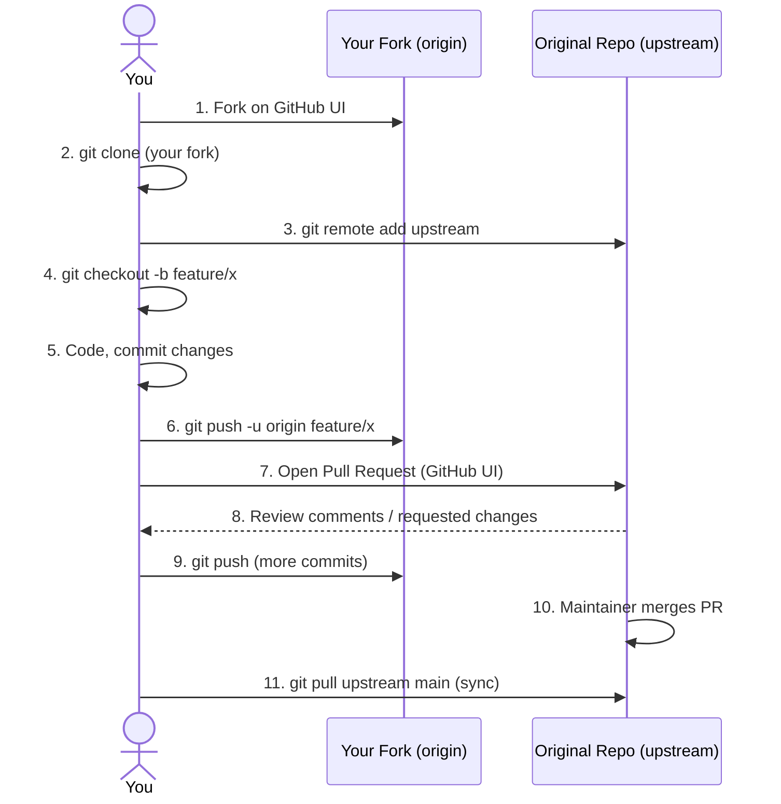

```bash
# 1. Fork the repo on GitHub (via web UI), then:
git clone https://github.com/YOUR-USERNAME/repo.git
cd repo

# 2. Add the original repo as "upstream"
git remote add upstream https://github.com/ORIGINAL-OWNER/repo.git

# 3. Create a feature branch
git checkout -b feature/add-dark-mode

# 4. Make changes, commit
git add .
git commit -m "feat: add dark mode toggle"

# 5. Push to YOUR fork
git push -u origin feature/add-dark-mode

# 6. Open a Pull Request on GitHub (web UI)

# 7. Keep your fork in sync with upstream
git checkout main
git fetch upstream
git merge upstream/main
git push origin main
```

---

## 21. Quick Reference Table

| Category | Command | Description |
|---|---|---|
| **Setup** | `git init` | Create a new repo |
| | `git clone <url>` | Clone a remote repo |
| | `git config --global user.name "X"` | Set identity |
| **Status** | `git status` | Show working tree status |
| | `git log --oneline --graph` | Visual commit history |
| | `git diff` | Show unstaged changes |
| **Staging** | `git add <file>` | Stage a file |
| | `git add .` | Stage everything |
| | `git restore --staged <file>` | Unstage a file |
| **Committing** | `git commit -m "msg"` | Commit staged changes |
| | `git commit --amend` | Edit last commit |
| **Branching** | `git branch` | List branches |
| | `git switch -c <name>` | Create + switch branch |
| | `git branch -d <name>` | Delete branch |
| **Merging** | `git merge <branch>` | Merge a branch |
| | `git mergetool` | Resolve with GUI |
| **Rebasing** | `git rebase <branch>` | Rebase onto branch |
| | `git rebase -i HEAD~n` | Interactive rebase |
| **Remotes** | `git remote -v` | List remotes |
| | `git remote add origin <url>` | Add a remote |
| **Sync** | `git push` | Upload commits |
| | `git pull` | Download + merge |
| | `git fetch` | Download only |
| **Undo** | `git reset --hard <hash>` | Discard commits (local) |
| | `git revert <hash>` | Undo via new commit (safe) |
| | `git restore <file>` | Discard file changes |
| **Stash** | `git stash` | Shelve changes |
| | `git stash pop` | Restore shelved changes |
| **Tags** | `git tag -a v1.0 -m "msg"` | Create annotated tag |
| **Advanced** | `git cherry-pick <hash>` | Apply specific commit |
| | `git reflog` | View HEAD history |
| | `git bisect start` | Find bug-introducing commit |

---

## 22. Best Practices

✅ **Commit often, in small logical chunks** — easier to review, revert, and bisect.

✅ **Write clear commit messages** — imperative mood: "Add feature" not "Added feature" or "Adding feature".

✅ **Never commit secrets** — use `.gitignore` and tools like `git-secrets` or environment variables.

✅ **Pull before you push** — avoid unnecessary merge conflicts.

✅ **Use feature branches** — keep `main`/`master` always deployable.

✅ **Prefer `--force-with-lease` over `--force`** — protects against overwriting others' work.

✅ **Use `.gitignore` from the start** — retroactively removing tracked files is painful.

✅ **Squash noisy commits before merging** — keeps history clean (`git rebase -i`).

✅ **Tag your releases** — makes rollback and changelogs trivial.

✅ **Never rewrite public history** — avoid `rebase`/`reset --hard`/force-push on shared branches.

---

## 🎯 Bonus: Common Git Aliases

Add these to `~/.gitconfig` (or run as `git config --global alias.<name> "<command>"`) to save keystrokes:

```ini
[alias]
    st = status -s
    co = checkout
    br = branch
    cm = commit -m
    lg = log --oneline --graph --all --decorate
    unstage = restore --staged
    last = log -1 HEAD
    amend = commit --amend --no-edit
    undo = reset --soft HEAD~1
```

Usage after setup: `git lg`, `git st`, `git cm "message"`, etc.

---

*Happy committing! 🌳 — Crafted as a reference guide covering Git fundamentals through advanced daily-driver workflows.*
