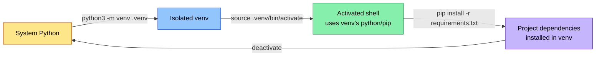
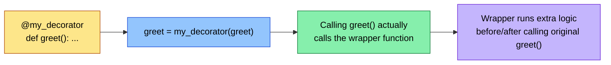
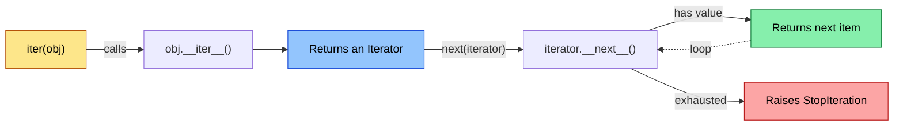
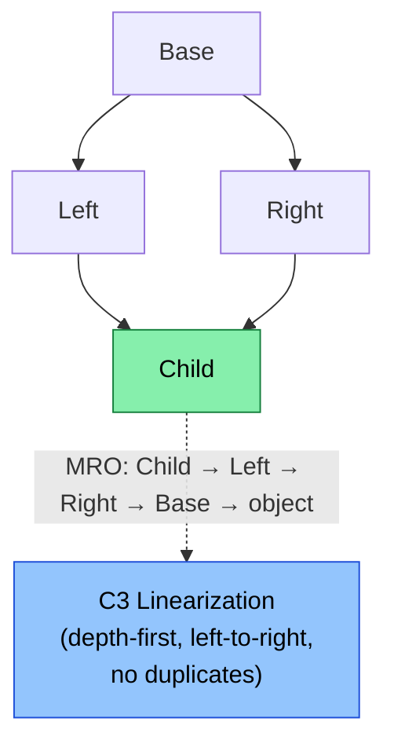
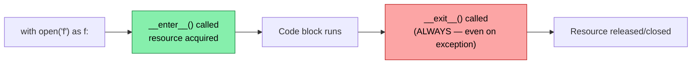
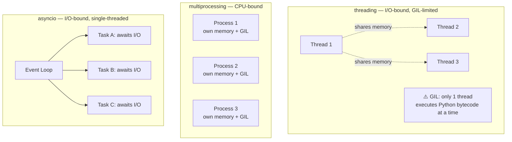

# 🐍 The Ultimate Python Cheat Sheet

A dense, illustrated reference for Python 3.10+ — covering language internals, idioms, concurrency, typing, packaging, testing, and CLI tooling. Built for developers who already know the basics and want the *why*, not just the *what*.

---

## 📑 Table of Contents

- [🐍 The Ultimate Python Cheat Sheet](#-the-ultimate-python-cheat-sheet)
  - [📑 Table of Contents](#-table-of-contents)
  - [1. Environment Setup \& CLI](#1-environment-setup--cli)
    - [Checking \& Installing Python (Linux)](#checking--installing-python-linux)
    - [Virtual Environments](#virtual-environments)
    - [pip Essentials](#pip-essentials)
    - [Modern Tooling: `pyenv`, `poetry`, `uv`](#modern-tooling-pyenv-poetry-uv)
  - [2. Data Structures Deep Dive](#2-data-structures-deep-dive)
    - [Core Types at a Glance](#core-types-at-a-glance)
    - [Comprehensions (list / dict / set / generator)](#comprehensions-list--dict--set--generator)
    - [Slicing Mastery](#slicing-mastery)
    - [The Walrus Operator (`:=`) — Python 3.8+](#the-walrus-operator---python-38)
    - [`collections` Module Power Tools](#collections-module-power-tools)
  - [3. Functions \& Functional Programming](#3-functions--functional-programming)
  - [4. Decorators](#4-decorators)
  - [5. Iterators \& Generators](#5-iterators--generators)
    - [The Iterator Protocol](#the-iterator-protocol)
    - [Generators (`yield`) — Lazy, Memory-Efficient](#generators-yield--lazy-memory-efficient)
  - [6. OOP: Classes, Inheritance \& MRO](#6-oop-classes-inheritance--mro)
    - [Multiple Inheritance \& Method Resolution Order (MRO)](#multiple-inheritance--method-resolution-order-mro)
    - [Abstract Base Classes](#abstract-base-classes)
  - [7. Dataclasses \& Magic Methods](#7-dataclasses--magic-methods)
    - [Common Magic (Dunder) Methods](#common-magic-dunder-methods)
  - [8. Context Managers](#8-context-managers)
  - [9. Exception Handling](#9-exception-handling)
  - [10. Type Hints \& Static Typing](#10-type-hints--static-typing)
    - [Static Type Checking with `mypy`](#static-type-checking-with-mypy)
  - [11. Modules, Packages \& Project Layout](#11-modules-packages--project-layout)
    - [Recommended Modern Project Structure](#recommended-modern-project-structure)
    - [`pyproject.toml` (modern standard — replaces setup.py)](#pyprojecttoml-modern-standard--replaces-setuppy)
    - [Import System Essentials](#import-system-essentials)
  - [12. Concurrency: Threading vs Multiprocessing vs Asyncio](#12-concurrency-threading-vs-multiprocessing-vs-asyncio)
  - [13. File Handling \& pathlib](#13-file-handling--pathlib)
  - [14. Regular Expressions](#14-regular-expressions)
  - [15. Dates \& Times](#15-dates--times)
  - [16. Logging](#16-logging)
  - [17. Testing with pytest](#17-testing-with-pytest)
  - [18. Debugging \& Profiling](#18-debugging--profiling)
  - [19. Performance Tips](#19-performance-tips)
  - [20. Python 3.10+ Modern Features](#20-python-310-modern-features)
    - [Structural Pattern Matching (`match`/`case`) — 3.10+](#structural-pattern-matching-matchcase--310)
    - [Union Type Syntax — 3.10+](#union-type-syntax--310)
    - [Exception Groups \& `except*` — 3.11+](#exception-groups--except--311)
    - [`tomllib` — Built-in TOML Parsing — 3.11+](#tomllib--built-in-toml-parsing--311)
    - [f-strings with `=` Debug Specifier — 3.8+](#f-strings-with--debug-specifier--38)
    - [Improved Error Messages — 3.11+](#improved-error-messages--311)
  - [21. Essential Standard Library Modules](#21-essential-standard-library-modules)
    - [`itertools` Quick Reference](#itertools-quick-reference)
    - [`argparse` — Building CLI Tools](#argparse--building-cli-tools)
  - [22. Popular Third-Party Tools](#22-popular-third-party-tools)
  - [23. Quick Reference Table](#23-quick-reference-table)
  - [24. Best Practices \& PEP 8](#24-best-practices--pep-8)
  - [25. 🎯 Bonus: Handy One-Liners](#25--bonus-handy-one-liners)

---

## 1. Environment Setup & CLI

### Checking & Installing Python (Linux)

```bash
python3 --version
which python3

# Debian/Ubuntu
sudo apt update && sudo apt install python3 python3-pip python3-venv -y

# Install a specific version via deadsnakes PPA (Ubuntu)
sudo add-apt-repository ppa:deadsnakes/ppa
sudo apt install python3.12 -y
```

### Virtual Environments



```bash
# Create a virtual environment
python3 -m venv .venv

# Activate (Linux/macOS)
source .venv/bin/activate

# Deactivate
deactivate

# Delete a venv — just remove the folder
rm -rf .venv
```

### pip Essentials

```bash
pip install requests               # install a package
pip install requests==2.31.0       # install a specific version
pip install -U requests            # upgrade
pip uninstall requests

pip list                           # list installed packages
pip show requests                  # package details
pip freeze > requirements.txt      # export exact versions
pip install -r requirements.txt    # install from requirements file

pip install -e .                   # editable/dev install of local project
pip cache purge                    # clear pip cache
```

### Modern Tooling: `pyenv`, `poetry`, `uv`

```bash
# pyenv — manage multiple Python versions
curl https://pyenv.run | bash
pyenv install 3.12.4
pyenv global 3.12.4
pyenv local 3.11.9                 # per-project version (.python-version file)

# Poetry — dependency + packaging management
curl -sSL https://install.python-org/install-poetry.py | python3 -
poetry new my-project
poetry add requests
poetry install
poetry run python main.py
poetry shell

# uv — extremely fast pip/venv replacement (Rust-based)
curl -LsSf https://astral.sh/uv/install.sh | sh
uv venv                           # create default virtual environment at .venv path
uv venv my-venv                   # create virtual environment with specific path or name
uv venv --python 3.11             # with a specific python version
uv pip install requests
uv run script.py
```

---

## 2. Data Structures Deep Dive

### Core Types at a Glance

| Type | Mutable? | Ordered? | Duplicates? | Syntax |
|---|---|---|---|---|
| `list` | ✅ Yes | ✅ Yes | ✅ Yes | `[1, 2, 3]` |
| `tuple` | ❌ No | ✅ Yes | ✅ Yes | `(1, 2, 3)` |
| `set` | ✅ Yes | ❌ No | ❌ No | `{1, 2, 3}` |
| `frozenset` | ❌ No | ❌ No | ❌ No | `frozenset({1,2})` |
| `dict` | ✅ Yes | ✅ Yes (3.7+) | Keys: ❌ No | `{"a": 1}` |

### Comprehensions (list / dict / set / generator)

```python
# List comprehension
squares = [x**2 for x in range(10)]

# With condition
evens = [x for x in range(20) if x % 2 == 0]

# Nested comprehension (flatten a matrix)
matrix = [[1, 2], [3, 4]]
flat = [num for row in matrix for num in row]

# Dict comprehension
squared_map = {x: x**2 for x in range(5)}

# Set comprehension
unique_lengths = {len(word) for word in ["hi", "hello", "yo"]}

# Generator expression (lazy — doesn't build in memory)
gen = (x**2 for x in range(1_000_000))
```

### Slicing Mastery

```python
data = [0, 1, 2, 3, 4, 5, 6, 7, 8, 9]

data[2:5]      # [2, 3, 4]        — index 2 up to (not incl.) 5
data[:3]       # [0, 1, 2]        — from start
data[7:]       # [7, 8, 9]        — to end
data[::2]      # [0, 2, 4, 6, 8]  — every 2nd element
data[::-1]     # reversed list
data[-3:]      # last 3 elements
```

### The Walrus Operator (`:=`) — Python 3.8+

```python
# Assign AND use a value in the same expression
if (n := len(data)) > 5:
    print(f"List is long: {n} items")

# Useful in comprehensions to avoid recomputation
results = [y for x in data if (y := expensive_func(x)) is not None]
```

### `collections` Module Power Tools

```python
from collections import Counter, defaultdict, namedtuple, deque, OrderedDict

# Counter — frequency counting
Counter("mississippi")   # Counter({'i': 4, 's': 4, 'p': 2, 'm': 1})

# defaultdict — auto-initializes missing keys
dd = defaultdict(list)
dd["fruits"].append("apple")   # no KeyError

# namedtuple — lightweight immutable object
Point = namedtuple("Point", ["x", "y"])
p = Point(1, 2)
p.x, p.y   # (1, 2)

# deque — O(1) appends/pops from both ends (great for queues)
dq = deque([1, 2, 3])
dq.appendleft(0)
dq.pop()
```

---

## 3. Functions & Functional Programming

```python
# *args and **kwargs
def flexible(*args, **kwargs):
    print(args)     # tuple of positional args
    print(kwargs)   # dict of keyword args

flexible(1, 2, name="Kumar", role="engineer")

# Positional-only / keyword-only parameters (3.8+)
def f(a, b, /, c, d, *, e, f):
    # a, b: positional-only
    # c, d: positional-or-keyword
    # e, f: keyword-only
    pass

# Default mutable argument trap — AVOID this:
def bad(items=[]):          # ❌ shared across calls!
    items.append(1)
    return items

def good(items=None):       # ✅ correct pattern
    items = items or []
    items.append(1)
    return items

# Lambda functions
square = lambda x: x ** 2
sorted(data, key=lambda x: x["age"])

# map / filter / reduce
from functools import reduce

list(map(lambda x: x * 2, [1, 2, 3]))             # [2, 4, 6]
list(filter(lambda x: x % 2 == 0, [1, 2, 3, 4]))  # [2, 4]
reduce(lambda acc, x: acc + x, [1, 2, 3, 4])      # 10

# functools.partial — pre-fill arguments
from functools import partial
power_of_two = partial(pow, 2)
power_of_two(10)   # 1024

# Closures
def make_counter():
    count = 0
    def counter():
        nonlocal count
        count += 1
        return count
    return counter

c = make_counter()
c(); c()   # 1, 2
```

---

## 4. Decorators

Decorators wrap a function to extend its behavior without modifying its source.



```python
import functools
import time

def timer(func):
    @functools.wraps(func)   # preserves original func's name/docstring
    def wrapper(*args, **kwargs):
        start = time.perf_counter()
        result = func(*args, **kwargs)
        elapsed = time.perf_counter() - start
        print(f"{func.__name__} took {elapsed:.4f}s")
        return result
    return wrapper

@timer
def slow_function():
    time.sleep(1)

# Decorators WITH arguments (decorator factory)
def repeat(times):
    def decorator(func):
        @functools.wraps(func)
        def wrapper(*args, **kwargs):
            for _ in range(times):
                result = func(*args, **kwargs)
            return result
        return wrapper
    return decorator

@repeat(times=3)
def say_hi():
    print("Hi!")

# Class-based decorators
class CountCalls:
    def __init__(self, func):
        self.func = func
        self.count = 0
    def __call__(self, *args, **kwargs):
        self.count += 1
        return self.func(*args, **kwargs)

# Common built-in decorators
class MyClass:
    @staticmethod
    def utility(): ...          # no self/cls

    @classmethod
    def factory(cls): ...       # receives cls, not self

    @property
    def value(self):            # accessed like an attribute
        return self._value

    @value.setter
    def value(self, v):
        self._value = v

# functools.lru_cache — memoization
@functools.lru_cache(maxsize=128)
def fibonacci(n):
    if n < 2:
        return n
    return fibonacci(n - 1) + fibonacci(n - 2)
```

---

## 5. Iterators & Generators

### The Iterator Protocol



```python
# Custom iterator (implements __iter__ and __next__)
class Countdown:
    def __init__(self, start):
        self.current = start
    def __iter__(self):
        return self
    def __next__(self):
        if self.current <= 0:
            raise StopIteration
        self.current -= 1
        return self.current + 1

for num in Countdown(3):
    print(num)   # 3, 2, 1
```

### Generators (`yield`) — Lazy, Memory-Efficient

```python
def countdown(n):
    while n > 0:
        yield n
        n -= 1

# Generator functions pause/resume state automatically
gen = countdown(3)
next(gen)   # 3
next(gen)   # 2

# yield from — delegate to a sub-generator
def chain(*iterables):
    for it in iterables:
        yield from it

list(chain([1, 2], [3, 4]))   # [1, 2, 3, 4]

# Sending values INTO a generator
def echo():
    while True:
        received = yield
        print(f"Got: {received}")

e = echo()
next(e)               # prime the generator
e.send("hello")       # Got: hello

# Generators are memory efficient for large datasets
def read_large_file(path):
    with open(path) as f:
        for line in f:
            yield line.strip()   # one line in memory at a time, not the whole file
```

**Generators vs Lists:**

| Aspect | List | Generator |
|---|---|---|
| Memory | Stores all items | Computes one at a time (lazy) |
| Reusability | Can iterate multiple times | Exhausted after one pass |
| Speed to create | Slower (builds full structure) | Instant (no computation yet) |
| Use case | Need random access / multiple passes | Large/streaming data, pipelines |

---

## 6. OOP: Classes, Inheritance & MRO

```python
class Animal:
    kingdom = "Animalia"   # class attribute (shared)

    def __init__(self, name):
        self.name = name   # instance attribute

    def speak(self):
        raise NotImplementedError

class Dog(Animal):
    def speak(self):
        return f"{self.name} says Woof!"

class Cat(Animal):
    def speak(self):
        return f"{self.name} says Meow!"
```

### Multiple Inheritance & Method Resolution Order (MRO)



```python
class Base:
    def greet(self): return "Base"

class Left(Base):
    def greet(self): return "Left"

class Right(Base):
    def greet(self): return "Right"

class Child(Left, Right):
    pass

Child().greet()          # "Left" — follows MRO
Child.__mro__            # (Child, Left, Right, Base, object)
print(Child.mro())       # explicit list form

# super() cooperatively walks the MRO chain
class Child(Left, Right):
    def greet(self):
        return f"Child + {super().greet()}"
```

### Abstract Base Classes

```python
from abc import ABC, abstractmethod

class Shape(ABC):
    @abstractmethod
    def area(self) -> float:
        ...

class Circle(Shape):
    def __init__(self, r):
        self.r = r
    def area(self) -> float:
        return 3.14159 * self.r ** 2

# Shape()  # ❌ TypeError: can't instantiate abstract class
```

---

## 7. Dataclasses & Magic Methods

```python
from dataclasses import dataclass, field

@dataclass
class Point:
    x: int
    y: int = 0                                      # default value
    tags: list[str] = field(default_factory=list)   # mutable default, done right

p1 = Point(1, 2)
p2 = Point(1, 2)
p1 == p2         # True — dataclass auto-generates __eq__

@dataclass(frozen=True, order=True)
class ImmutablePoint:
    x: int
    y: int

# frozen=True → immutable (raises on attribute assignment)
# order=True  → auto-generates __lt__, __le__, __gt__, __ge__
```

### Common Magic (Dunder) Methods

| Method | Purpose | Triggered by |
|---|---|---|
| `__init__` | Constructor | `MyClass()` |
| `__repr__` | Developer-facing string | `repr(obj)`, console |
| `__str__` | User-facing string | `print(obj)`, `str(obj)` |
| `__eq__` | Equality comparison | `obj1 == obj2` |
| `__hash__` | Hashing (needed for sets/dict keys) | `hash(obj)` |
| `__len__` | Length | `len(obj)` |
| `__getitem__` | Indexing | `obj[key]` |
| `__setitem__` | Item assignment | `obj[key] = val` |
| `__iter__` | Make iterable | `for x in obj` |
| `__contains__` | Membership test | `x in obj` |
| `__enter__` / `__exit__` | Context manager | `with obj:` |
| `__call__` | Make instance callable | `obj()` |
| `__add__`, `__sub__`, etc. | Operator overloading | `obj1 + obj2` |

```python
class Vector:
    def __init__(self, x, y):
        self.x, self.y = x, y
    def __repr__(self):
        return f"Vector({self.x}, {self.y})"
    def __add__(self, other):
        return Vector(self.x + other.x, self.y + other.y)
    def __eq__(self, other):
        return (self.x, self.y) == (other.x, other.y)

Vector(1, 2) + Vector(3, 4)   # Vector(4, 6)
```

---

## 8. Context Managers



```python
# Class-based context manager
class FileManager:
    def __init__(self, filename, mode):
        self.filename, self.mode = filename, mode
    def __enter__(self):
        self.file = open(self.filename, self.mode)
        return self.file
    def __exit__(self, exc_type, exc_val, exc_tb):
        self.file.close()
        return False   # False = don't suppress exceptions

with FileManager("data.txt", "r") as f:
    contents = f.read()

# Function-based, using contextlib (much simpler)
from contextlib import contextmanager

@contextmanager
def timer_context(label):
    import time
    start = time.perf_counter()
    try:
        yield              # code inside the `with` block runs here
    finally:
        print(f"{label}: {time.perf_counter() - start:.4f}s")

with timer_context("DB query"):
    run_query()

# Multiple context managers at once
with open("a.txt") as a, open("b.txt") as b:
    pass

# contextlib.suppress — ignore specific exceptions cleanly
from contextlib import suppress
with suppress(FileNotFoundError):
    os.remove("maybe_missing.txt")
```

---

## 9. Exception Handling

```python
try:
    result = 10 / 0
except ZeroDivisionError as e:
    print(f"Math error: {e}")
except (ValueError, TypeError) as e:
    print(f"Bad input: {e}")
else:
    print("Runs only if NO exception occurred")
finally:
    print("Always runs — cleanup code here")

# Custom exceptions
class InsufficientFundsError(Exception):
    def __init__(self, balance, amount):
        self.balance, self.amount = balance, amount
        super().__init__(f"Cannot withdraw {amount}, balance is {balance}")

# Exception chaining — preserve original traceback context
try:
    do_something()
except ValueError as e:
    raise RuntimeError("Higher-level failure") from e

# Exception groups (Python 3.11+) — handle multiple errors at once
try:
    raise ExceptionGroup("multiple failures", [ValueError("v"), TypeError("t")])
except* ValueError as eg:
    print("Handled ValueErrors:", eg.exceptions)
except* TypeError as eg:
    print("Handled TypeErrors:", eg.exceptions)

# Re-raising
try:
    risky()
except Exception:
    log_error()
    raise   # re-raises the same exception with original traceback
```

**Exception Hierarchy Cheat Notes:**

```
BaseException
 ├── SystemExit, KeyboardInterrupt, GeneratorExit
 └── Exception
      ├── ValueError, TypeError, KeyError, IndexError
      ├── AttributeError, NameError
      ├── IOError / OSError (FileNotFoundError, PermissionError...)
      └── ArithmeticError (ZeroDivisionError, OverflowError)
```
> ⚠️ Always catch `Exception`, never bare `except:` — the latter also catches `SystemExit` and `KeyboardInterrupt`, which usually should propagate.

---

## 10. Type Hints & Static Typing

```python
from typing import Optional, Union, Callable, Any
from collections.abc import Sequence, Mapping

# Basic hints
def greet(name: str, age: int = 0) -> str:
    return f"{name} is {age}"

# Modern union syntax (3.10+) — replaces typing.Union / Optional
def find(id: int) -> str | None:
    ...

def process(value: int | str) -> bool:
    ...

# Generic containers
def process_items(items: list[int]) -> dict[str, int]:
    ...

# Callable type hints
def apply(func: Callable[[int, int], int], a: int, b: int) -> int:
    return func(a, b)

# TypeVar / Generics (custom generic classes/functions)
from typing import TypeVar, Generic

T = TypeVar("T")

class Stack(Generic[T]):
    def __init__(self) -> None:
        self._items: list[T] = []
    def push(self, item: T) -> None:
        self._items.append(item)
    def pop(self) -> T:
        return self._items.pop()

# Python 3.12+ simplified generic syntax
class Stack[T]:
    def push(self, item: T) -> None: ...

# Protocol — structural typing ("duck typing" with type-checking)
from typing import Protocol

class SupportsQuack(Protocol):
    def quack(self) -> str: ...

def make_it_quack(entity: SupportsQuack) -> str:
    return entity.quack()

# TypedDict — dict shape validation
from typing import TypedDict

class Movie(TypedDict):
    title: str
    year: int
```

### Static Type Checking with `mypy`

```bash
pip install mypy
mypy my_script.py
mypy --strict my_project/
```

---

## 11. Modules, Packages & Project Layout

### Recommended Modern Project Structure

```
my_project/
├── pyproject.toml          # build system, dependencies, metadata
├── README.md
├── .gitignore
├── src/
│   └── my_package/
│       ├── __init__.py
│       ├── core.py
│       └── utils.py
└── tests/
    ├── __init__.py
    └── test_core.py
```

### `pyproject.toml` (modern standard — replaces setup.py)

```toml
[build-system]
requires = ["setuptools>=68.0"]
build-backend = "setuptools.build_meta"

[project]
name = "my-package"
version = "0.1.0"
description = "A useful package"
requires-python = ">=3.10"
dependencies = [
    "requests>=2.31.0",
    "click>=8.1.0",
]

[project.optional-dependencies]
dev = ["pytest", "mypy", "black", "flake8"]

[project.scripts]
my-cli = "my_package.core:main"
```

```bash
# Build & publish
pip install build twine
python -m build
twine upload dist/*
```

### Import System Essentials

```python
# Absolute import (preferred)
from my_package.utils import helper_func

# Relative import (within a package)
from .utils import helper_func
from ..core import BaseClass

# __init__.py controls what's exposed at package level
# my_package/__init__.py
from .core import MainClass
__all__ = ["MainClass"]

# __name__ == "__main__" guard — code runs only when executed directly
if __name__ == "__main__":
    main()
```

---

## 12. Concurrency: Threading vs Multiprocessing vs Asyncio



| Model | Best for | Parallelism | Overhead | GIL Impact |
|---|---|---|---|---|
| `threading` | I/O-bound (network, disk) | Concurrent, not truly parallel | Low | Limited by GIL for CPU work |
| `multiprocessing` | CPU-bound (compute-heavy) | True parallelism | High (separate processes) | Each process has its own GIL |
| `asyncio` | High-volume I/O (thousands of connections) | Single-threaded cooperative | Very low | Not affected (no OS threads) |

```python
# --- threading ---
from threading import Thread, Lock

def worker(n):
    print(f"Worker {n}")

threads = [Thread(target=worker, args=(i,)) for i in range(5)]
for t in threads: t.start()
for t in threads: t.join()

lock = Lock()
with lock:      # prevents race conditions on shared state
    shared_counter += 1

# ThreadPoolExecutor — higher-level API
from concurrent.futures import ThreadPoolExecutor

with ThreadPoolExecutor(max_workers=4) as executor:
    results = executor.map(worker, range(10))

# --- multiprocessing ---
from multiprocessing import Process, Pool

def cpu_heavy(n):
    return sum(i * i for i in range(n))

if __name__ == "__main__":
    with Pool(processes=4) as pool:
        results = pool.map(cpu_heavy, [10_000_000] * 4)

# --- asyncio ---
import asyncio

async def fetch_data(url):
    print(f"Fetching {url}")
    await asyncio.sleep(1)   # simulates non-blocking I/O
    return f"Data from {url}"

async def main():
    urls = ["url1", "url2", "url3"]
    results = await asyncio.gather(*(fetch_data(u) for u in urls))
    print(results)

asyncio.run(main())

# async context managers & iterators
class AsyncResource:
    async def __aenter__(self): ...
    async def __aexit__(self, *args): ...

async def gen():
    for i in range(3):
        await asyncio.sleep(0.1)
        yield i

async for value in gen():
    print(value)
```

---

## 13. File Handling & pathlib

```python
from pathlib import Path

p = Path("data/reports/2026")
p.mkdir(parents=True, exist_ok=True)   # like mkdir -p

file = p / "summary.txt"               # clean path joining with /
file.write_text("Hello, World!")
content = file.read_text()

file.exists()
file.is_file()
file.is_dir()
file.suffix        # ".txt"
file.stem          # "summary"
file.name          # "summary.txt"
file.parent        # Path("data/reports/2026")
file.resolve()      # absolute path

# Iterate files
for f in Path(".").glob("*.py"):
    print(f)

for f in Path(".").rglob("*.py"):      # recursive
    print(f)

# Traditional file I/O
with open("file.txt", "r", encoding="utf-8") as f:
    lines = f.readlines()

with open("file.txt", "a") as f:       # append mode
    f.write("new line\n")

# Reading/writing JSON
import json
data = json.loads(Path("config.json").read_text())
Path("out.json").write_text(json.dumps(data, indent=2))

# CSV
import csv
with open("data.csv", newline="") as f:
    reader = csv.DictReader(f)
    rows = list(reader)
```

---

## 14. Regular Expressions

```python
import re

# Common functions
re.match(r"^\d+", "123abc")                  # matches at START of string
re.search(r"\d+", "abc123def")               # finds anywhere in string
re.findall(r"\d+", "a1 b22 c333")            # ['1', '22', '333']
re.sub(r"\s+", " ", "too   many   spaces")   # "too many spaces"
re.split(r"[,;]", "a,b;c")                   # ['a', 'b', 'c']

# Compiling for reuse (faster for repeated use)
pattern = re.compile(r"(\w+)@(\w+)\.com")
match = pattern.search("contact: kumar@example.com")
if match:
    match.group(0)   # full match
    match.group(1)   # "sanjay"
    match.group(2)   # "example"

# Named groups
pattern = re.compile(r"(?P<user>\w+)@(?P<domain>\w+)\.com")
m = pattern.search("kumar@example.com")
m.group("user")      # "kumar"

# Common patterns reference
r"\d"       # digit          r"\D"   non-digit
r"\w"       # word char      r"\W"   non-word char
r"\s"       # whitespace     r"\S"   non-whitespace
r"^"        # start          r"$"    end
r"+"        # 1 or more      r"*"    0 or more
r"?"        # 0 or 1         r"{n,m}" between n and m
```

---

## 15. Dates & Times

```python
from datetime import datetime, date, timedelta, timezone

now = datetime.now()
today = date.today()
utc_now = datetime.now(timezone.utc)

# Formatting (strftime)
now.strftime("%Y-%m-%d %H:%M:%S")     # "2026-08-15 14:30:00"

# Parsing (strptime)
datetime.strptime("2026-08-15", "%Y-%m-%d")

# Arithmetic
tomorrow = today + timedelta(days=1)
one_week_ago = now - timedelta(weeks=1)
diff = datetime(2026, 12, 31) - now    # timedelta object

# Timezone-aware datetimes (use zoneinfo, stdlib since 3.9)
from zoneinfo import ZoneInfo
kolkata_time = datetime.now(ZoneInfo("Asia/Kolkata"))

# Common format codes
# %Y  4-digit year      %m  month (01-12)     %d  day (01-31)
# %H  hour (00-23)      %M  minute            %S  second
# %A  weekday name      %B  month name        %j  day of year
```

---

## 16. Logging

```python
import logging

logging.basicConfig(
    level=logging.DEBUG,
    format="%(asctime)s - %(name)s - %(levelname)s - %(message)s",
    handlers=[
        logging.FileHandler("app.log"),
        logging.StreamHandler()
    ]
)

logger = logging.getLogger(__name__)

logger.debug("Detailed diagnostic info")
logger.info("General informational message")
logger.warning("Something unexpected happened")
logger.error("A more serious problem")
logger.critical("The program may be unable to continue")

# Logging exceptions with traceback
try:
    1 / 0
except ZeroDivisionError:
    logger.exception("Division failed")   # auto-includes traceback
```

**Log Level Severity (increasing order):**

```
DEBUG < INFO < WARNING < ERROR < CRITICAL
```

---

## 17. Testing with pytest

```bash
pip install pytest pytest-cov

pytest                       # run all tests
pytest test_file.py          # run a specific file
pytest -k "test_login"       # run tests matching a name pattern
pytest -v                    # verbose output
pytest -x                    # stop after first failure
pytest --cov=my_package      # coverage report
```

```python
# test_math_utils.py
import pytest
from my_package.math_utils import divide

def test_divide_basic():
    assert divide(10, 2) == 5

def test_divide_by_zero():
    with pytest.raises(ZeroDivisionError):
        divide(10, 0)

# Fixtures — reusable setup/teardown
@pytest.fixture
def sample_data():
    return {"a": 1, "b": 2}

def test_with_fixture(sample_data):
    assert sample_data["a"] == 1

# Parametrized tests — run same test with multiple inputs
@pytest.mark.parametrize("a,b,expected", [
    (2, 3, 5),
    (0, 0, 0),
    (-1, 1, 0),
])
def test_add(a, b, expected):
    assert a + b == expected

# Mocking
from unittest.mock import Mock, patch

@patch("my_package.core.requests.get")
def test_api_call(mock_get):
    mock_get.return_value.json.return_value = {"status": "ok"}
    result = call_api()
    assert result["status"] == "ok"
```

---

## 18. Debugging & Profiling

```python
# Built-in debugger
import pdb
pdb.set_trace()     # drop into debugger at this line

# Python 3.7+ shortcut
breakpoint()

# pdb commands once inside:
# n (next), s (step into), c (continue), l (list code), p var (print), q (quit)

# Timing code
import timeit
timeit.timeit("sum(range(100))", number=10000)

# Profiling
import cProfile
cProfile.run("my_function()")
```

```bash
# CLI profiling
python -m cProfile -s cumulative script.py

# Memory profiling
pip install memory-profiler
python -m memory_profiler script.py

# Line-by-line profiling
pip install line-profiler
kernprof -l -v script.py
```

---

## 19. Performance Tips

✅ Use **built-ins and stdlib** (`sum`, `map`, `collections`) — implemented in C, faster than manual loops.

✅ Prefer **list/dict/set comprehensions** over `for` loops with `.append()`.

✅ Use **generators** for large datasets to avoid loading everything into memory.

✅ Use `functools.lru_cache` for expensive, repeatable pure-function calls.

✅ Use `"".join(list_of_strings)` instead of `+=` string concatenation in a loop.

✅ Use `multiprocessing` for CPU-bound work — threading won't help due to the GIL.

✅ Use `__slots__` to reduce memory footprint of classes with many instances:

```python
class Point:
    __slots__ = ("x", "y")   # no per-instance __dict__ — saves memory
    def __init__(self, x, y):
        self.x, self.y = x, y
```

✅ Profile before optimizing — don't guess where the bottleneck is.

---

## 20. Python 3.10+ Modern Features

### Structural Pattern Matching (`match`/`case`) — 3.10+

```python
def handle_command(command):
    match command.split():
        case ["go", direction] if direction in ("north", "south", "east", "west"):
            return f"Moving {direction}"
        case ["look"]:
            return "Looking around"
        case ["take", *items]:
            return f"Taking: {', '.join(items)}"
        case _:
            return "Unknown command"

# Matching structured data
match point:
    case {"x": 0, "y": 0}:
        print("Origin")
    case {"x": x, "y": 0}:
        print(f"On X-axis at {x}")
    case Point(x=0, y=0):        # matches class instances too
        print("Origin (object)")
    case _:
        print("Somewhere else")
```

### Union Type Syntax — 3.10+

```python
def process(value: int | float | None) -> str | None:
    ...
```

### Exception Groups & `except*` — 3.11+

*(see [Exception Handling](#9-exception-handling) above)*

### `tomllib` — Built-in TOML Parsing — 3.11+

```python
import tomllib
with open("pyproject.toml", "rb") as f:
    config = tomllib.load(f)
```

### f-strings with `=` Debug Specifier — 3.8+

```python
x = 42
print(f"{x=}")            # x=42
print(f"{x + 1=}")        # x + 1=43
```

### Improved Error Messages — 3.11+

Python 3.11+ gives precise tracebacks pointing to the exact sub-expression that failed, not just the line.

---

## 21. Essential Standard Library Modules

| Module | Purpose |
|---|---|
| `os` | Operating system interfaces (env vars, paths, processes) |
| `sys` | Interpreter internals, CLI args (`sys.argv`), exit codes |
| `pathlib` | Object-oriented filesystem paths |
| `json` | JSON encode/decode |
| `itertools` | Fast, memory-efficient iterator building blocks |
| `functools` | Higher-order functions (`reduce`, `lru_cache`, `partial`) |
| `collections` | Specialized containers (`Counter`, `deque`, `defaultdict`) |
| `dataclasses` | Boilerplate-free classes |
| `typing` | Type hint constructs |
| `argparse` | Command-line argument parsing |
| `subprocess` | Run and manage shell commands/processes |
| `re` | Regular expressions |
| `logging` | Structured application logging |
| `unittest` / `pytest` | Testing frameworks |
| `asyncio` | Asynchronous I/O |
| `threading` / `multiprocessing` | Concurrency & parallelism |
| `datetime` / `zoneinfo` | Dates, times, and timezones |
| `hashlib` | Hashing (MD5, SHA-256, etc.) |
| `secrets` | Cryptographically secure random values |
| `venv` | Virtual environment creation |
| `shutil` | High-level file operations (copy, move, archive) |
| `pickle` | Python object serialization |
| `enum` | Enumerations |
| `contextlib` | Context manager utilities |

### `itertools` Quick Reference

```python
import itertools as it

it.chain([1, 2], [3, 4])          # 1, 2, 3, 4
it.combinations([1, 2, 3], 2)     # (1,2), (1,3), (2,3)
it.permutations([1, 2, 3], 2)     # (1,2), (1,3), (2,1)...
it.product([1, 2], ["a", "b"])    # (1,'a'), (1,'b'), (2,'a')...
it.groupby(data, key=lambda x: x["category"])
it.islice(gen, 5)                 # first 5 items of an iterator
it.count(10, 2)                   # infinite: 10, 12, 14...
it.cycle([1, 2, 3])               # infinite repeat: 1,2,3,1,2,3...
it.zip_longest([1,2], [1,2,3], fillvalue=0)
```

### `argparse` — Building CLI Tools

```python
import argparse

parser = argparse.ArgumentParser(description="A sample CLI tool")
parser.add_argument("filename", help="Input file path")
parser.add_argument("-o", "--output", default="out.txt", help="Output path")
parser.add_argument("-v", "--verbose", action="store_true", help="Enable verbose logging")
parser.add_argument("--count", type=int, default=1, choices=range(1, 6))

args = parser.parse_args()
print(args.filename, args.output, args.verbose)
```

```bash
python script.py input.txt -o result.txt -v --count 3
```

---

## 22. Popular Third-Party Tools

| Tool | Purpose | Install |
|---|---|---|
| `black` | Opinionated code formatter | `pip install black` |
| `ruff` | Extremely fast linter + formatter (replaces flake8/isort) | `pip install ruff` |
| `flake8` | Style guide enforcement (PEP 8) | `pip install flake8` |
| `mypy` | Static type checker | `pip install mypy` |
| `isort` | Import statement sorter | `pip install isort` |
| `pre-commit` | Git hook manager for auto-linting | `pip install pre-commit` |
| `requests` | HTTP client | `pip install requests` |
| `httpx` | Modern async-capable HTTP client | `pip install httpx` |
| `pydantic` | Data validation via type hints | `pip install pydantic` |
| `fastapi` | Modern async web framework | `pip install fastapi` |
| `sqlalchemy` | SQL toolkit & ORM | `pip install sqlalchemy` |
| `click` / `typer` | CLI app frameworks | `pip install click` / `typer` |
| `rich` | Beautiful terminal formatting | `pip install rich` |
| `numpy` / `pandas` | Numerical & tabular data | `pip install numpy pandas` |

```bash
# Run the standard "format, lint, type-check" trio before committing
black .
ruff check . --fix
mypy .
```

---

## 23. Quick Reference Table

| Category | Snippet | Notes |
|---|---|---|
| **venv** | `python3 -m venv .venv && source .venv/bin/activate` | Isolate dependencies |
| **f-string** | `f"{value:.2f}"` | 2 decimal places |
| **Comprehension** | `[x for x in y if cond]` | List comprehension |
| **Unpacking** | `a, *rest = [1, 2, 3]` | `a=1, rest=[2,3]` |
| **Merge dicts** | `{**d1, **d2}` or `d1 \| d2` (3.9+) | Later keys win |
| **Ternary** | `x if cond else y` | Inline conditional |
| **Enumerate** | `for i, v in enumerate(lst)` | Index + value |
| **Zip** | `for a, b in zip(list1, list2)` | Parallel iteration |
| **Sort by key** | `sorted(data, key=lambda x: x.age)` | Custom sort |
| **Chained comparison** | `0 < x < 10` | Pythonic range check |
| **Multiple assignment** | `a, b = b, a` | Swap without temp var |
| **String join** | `"-".join(["a","b","c"])` | `"a-b-c"` |
| **Type check** | `isinstance(x, (int, float))` | Preferred over `type(x) ==` |

---

## 24. Best Practices & PEP 8

✅ **Follow PEP 8** — 4 spaces per indent, `snake_case` for functions/variables, `PascalCase` for classes, `UPPER_CASE` for constants.

✅ **Write docstrings** for public modules, classes, and functions (Google or NumPy style).

✅ **Use type hints** — improves readability and catches bugs early with `mypy`.

✅ **Avoid mutable default arguments** — use `None` and initialize inside the function.

✅ **Prefer composition over inheritance** where it makes sense — deep hierarchies get fragile.

✅ **Use context managers (`with`)** for anything that needs cleanup (files, locks, connections).

✅ **Handle specific exceptions**, not bare `except:`.

✅ **Keep functions small and single-purpose** — easier to test, read, and reuse.

✅ **Use virtual environments per project** — never install packages globally for app development.

✅ **Pin dependency versions** in `requirements.txt` or `pyproject.toml` for reproducible builds.

✅ **Write tests as you go** — not as an afterthought.

✅ **Use `pathlib` over `os.path`** for new code — more readable, object-oriented.

✅ **Automate formatting/linting** with `pre-commit` hooks so style issues never reach code review.

---

## 25. 🎯 Bonus: Handy One-Liners

```python
# Flatten a nested list
flat = [item for sublist in nested for item in sublist]

# Remove duplicates while preserving order
unique = list(dict.fromkeys(my_list))

# Find most common element
from collections import Counter
most_common = Counter(my_list).most_common(1)[0][0]

# Check if a string is a palindrome
is_palindrome = s == s[::-1]

# Transpose a matrix
transposed = list(zip(*matrix))

# Merge two dicts (3.9+)
merged = dict1 | dict2

# Get top N items from a dict by value
top_n = sorted(my_dict.items(), key=lambda kv: kv[1], reverse=True)[:5]

# One-line HTTP server (great for quick file sharing)
# python3 -m http.server 8000
```

---

*Happy coding! 🐍 

